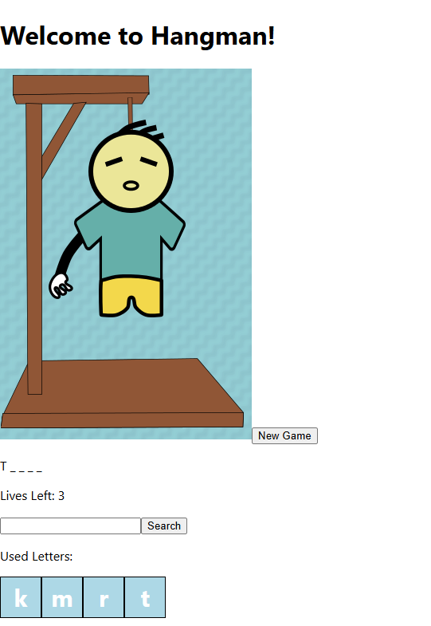

# Hangman



## Description  
A simple Hangman game built with React using class-based components.

## How to Play
1. Guess letters one at a time to reveal the hidden word.
2. You have 6 lives. Each incorrect guess reduces your lives by 1.
3. Win by guessing all the letters in the word before running out of lives.

### Running the app

1. Clone the repository of the project in the terminal using:
````
git clone https://github.com/JahmaliB/Hangman.git
````

2. Change your current directory to the project's directory using:
````
cd Hangman
````

3. Install the dependencies needed to run the program using:
````
npm install
````

4. Start the server using:
````
npm start
````

5. (Optional) Your program should open automatically but if it does not copy and paste this into your browser:
'http://localhost:3000'
